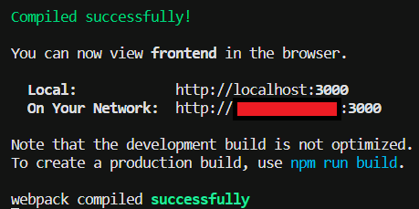
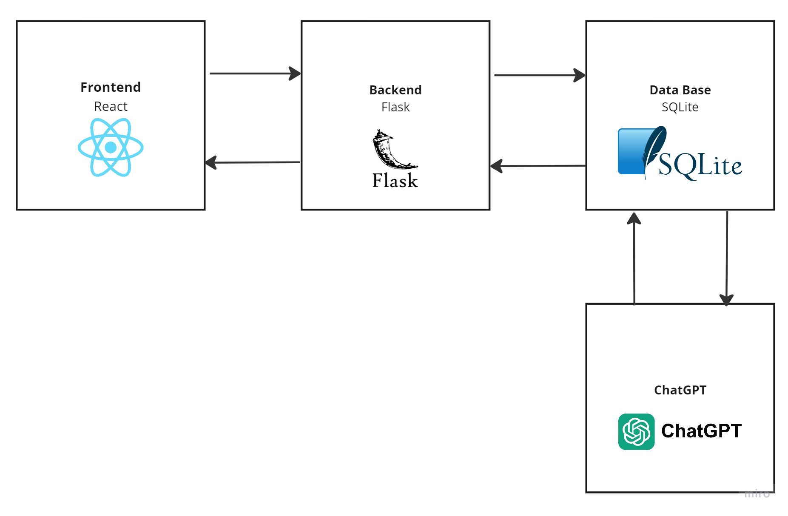
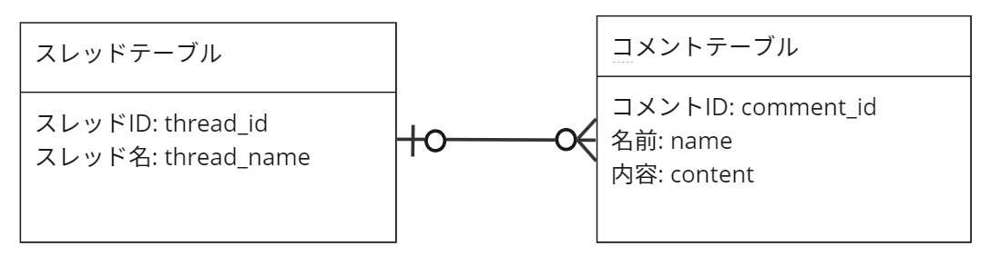

# keijibanGPT
WINCハッカソン夏期２０２３グループ３のアプリ

## Description
これは掲示板アプリです。しかし、ときどきChatGPTがスレッドを盛り上げてくれます。

## Author
佐藤旅人、福永大、藤田開、堀江広晃、矢代琉介

## Date
2023年9月10日

## Getting Started

### Requires
* Mac OS 12.6.7 or Ubuntu 22.04.2 LTS
* Python 3.11.5
* pip 23.2.1
* Docker 24.0.5

### Execute Program
* Run Frontend and Backend Server
```bash
docker-compose up
```

* Add your API KEY (First time only)
```bash
cd backend
echo "PUT YOUR API KEY for ChatGPT" > api_key.txt
```
*`"PUT YOUR API KEY for ChatGPT"`の部分はあなたのAPI KEYに変更してください。API KEYは[こちら](https://platform.openai.com/account/api-keys)で入手できます。*

* Run ChatGPT (Use another terminal)
```bash
cd backend
pip install openai
python GPT.py
```

* Delete Data Base
```bash
cd backend
rm comment.db thread.db
```

* Delete Docker
```bash
docker-compose down
```

## Share your Bulletin Board
1. Change your branch from `main` to `share`
2. Run frontend server and check your Network IP address

3. Add this IP address to `frontend/src/api/ApiClient.js`

## Design
このプロジェクトでは、フロントエンドにはReact、バックエンドではFlaskを用いた掲示板アプリを作成しました。ユーザーは自由にスレッド、コメントを追加することが出来ます。データベースにはSQLiteを用いており、FlaskがSQLiteにデータを保存しています。また、20分に一度、ChatGPTがデータベースにアクセスし、コメントをそれぞれのスレッドに追加します。


Data Baseでは以下のようなテーブルを作成しています。

